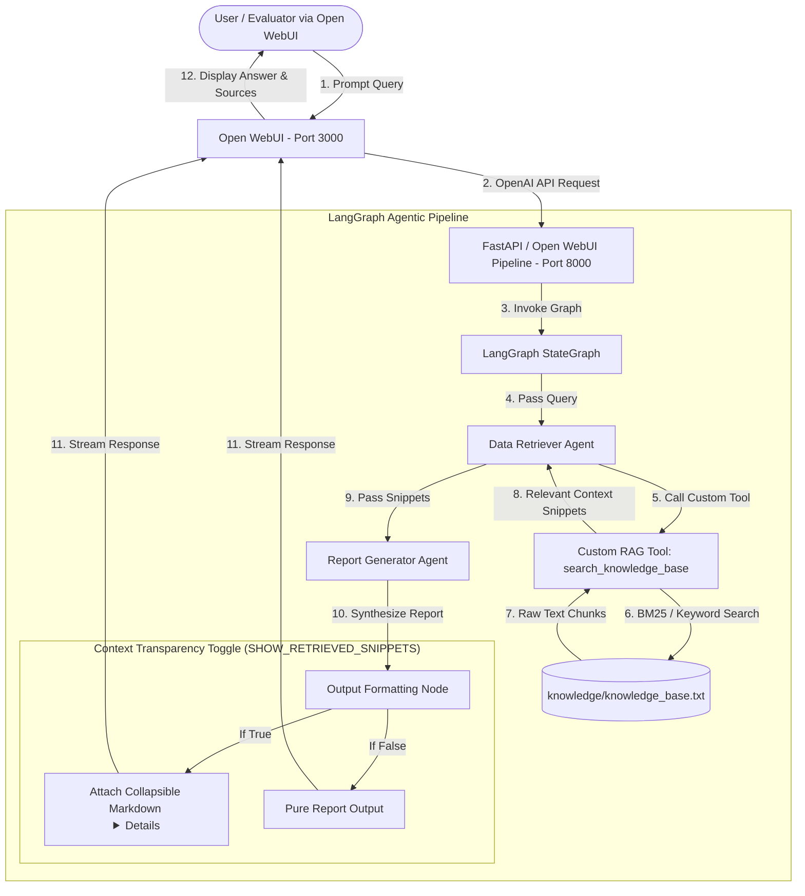

# 🚀 Architectural Plan: Agentic AI Report Generator

## 📌 Executive Summary
This project implements an **Agentic RAG System** using **LangGraph / LangChain** to fulfill the Bangkok Bank AI Engineer Programming Test requirements. 

The system features two orchestrated AI agents:
1. **Data Retriever Agent (RAG):** Searches `knowledge/knowledge_base.txt` using a custom Python retrieval tool and returns relevant context snippets.
2. **Report Generator Agent:** Synthesizes retrieved snippets into a cohesive, non-redundant, well-formatted report.

The entire solution is wrapped into a **single `docker-compose.yml`** combining an **Open WebUI frontend** and a **FastAPI + LangGraph backend**, allowing evaluators to clone, configure `.env`, run `docker compose up -d`, and interact with the system via a modern web interface.

---

## 🏗️ System Architecture & Workflow



---

## 🔍 Context Transparency Feature (Retrieved Snippets Toggle)

To allow evaluators to immediately verify that **Agent 1 (Data Retriever)** found the correct text snippets before **Agent 2 (Report Generator)** wrote the answer:

- **Configurable via `.env` or Request:** `SHOW_RETRIEVED_SNIPPETS=true` (Default: `true`).
- **Markdown Collapsible Format in Open WebUI:**
  ```markdown
  # 📊 Synthesized Report: Bangkok Bank History

  Bangkok Bank Public Company Limited was established on November 20, 1944...

  ---
  <details>
  <summary>🔍 View Retrieved Context Snippets (Agent 1 RAG Output)</summary>

  > **Snippet 1 (Topic 4 - Bangkok Bank):**  
  > *"Bangkok Bank Public Company Limited was established in 1944 and was listed on the Stock Exchange of Thailand in 1975..."*

  > **Snippet 2 (Topic 4 - Bangkok Bank):**  
  > *"ธนาคารกรุงเทพ จำกัด (มหาชน) จดทะเบียนก่อตั้งขึ้นเมื่อวันที่ 20 พฤศจิกายน พ.ศ. 2487..."*

  </details>
  ```

---

## 🔌 Plug-and-Play LLM Factory (`llm_factory.py`)

The pipeline supports any LLM provider via `.env` configuration without changing any code:

1. **LiteLLM Gateway / vLLM (Your Company Setup):**
   - `LLM_PROVIDER=openai_compatible`
   - `OPENAI_BASE_URL=http://your-litellm-gateway:8000/v1`
   - `OPENAI_API_KEY=your_api_key`
   - `OPENAI_MODEL=your_vllm_model_name`
2. **Azure OpenAI (Default BBL Candidate Endpoint):**
   - `LLM_PROVIDER=azure`
   - `AZURE_OPENAI_ENDPOINT=https://oaibblinnocandiddate01.openai.azure.com/`
   - `AZURE_OPENAI_API_KEY=<key>`
   - `AZURE_OPENAI_DEPLOYMENT=gpt-5-mini`
3. **Standard OpenAI:**
   - `LLM_PROVIDER=openai`
   - `OPENAI_API_KEY=<key>`
   - `OPENAI_MODEL=gpt-4o-mini`

---

## 📂 File & Directory Structure

```
AI_Report_Generator/
├── docker-compose.yml          # Single command setup (Open WebUI + Agent Backend)
├── .env.example                # Template for LLM provider & API keys
├── .gitignore                  # Docker data, Python cache, and secret exclusions
├── README.md                   # Comprehensive candidate documentation & setup guide
├── ASSIGMENT.md                # Original test specifications
├── PLAN.md                     # Architectural plan & execution strategy
├── knowledge/
│   └── knowledge_base.txt      # 7-topic bilingual knowledge base file
├── scripts/
│   └── fetch_knowledge.py      # Automated 100% live web scraping script
└── backend/
    ├── Dockerfile              # Container definition for Python LangGraph service
    ├── requirements.txt        # FastAPI, LangGraph, LangChain dependencies
    ├── main.py                 # FastAPI server exposing OpenAI-compatible endpoint
    ├── config.py               # Configuration loader for .env
    ├── rag_tool.py             # Custom Data Retriever RAG tool (BM25 + keyword search)
    ├── agents.py               # Data Retriever & Report Generator prompt & node definitions
    ├── graph.py                # LangGraph StateGraph workflow orchestration
    └── llm_factory.py          # Unified LLM provider switch (LiteLLM/vLLM, Azure, OpenAI)
```

---

## 🛠️ Step-by-Step Implementation Strategy

### Phase 1: Core LangGraph Agent Backend (`backend/`)
- Implement `llm_factory.py` for flexible LiteLLM/vLLM / Azure OpenAI / OpenAI switching.
- Implement `rag_tool.py`: a custom Python function that parses `knowledge/knowledge_base.txt`, splits into chunks, and performs BM25 + keyword retrieval.
- Implement `agents.py` & `graph.py`: Define LangGraph `StateGraph` connecting `Data Retriever` -> `Report Generator`.
- Implement `SHOW_RETRIEVED_SNIPPETS` formatting node for collapsible context display.

### Phase 2: FastAPI Service & Open WebUI Integration
- Build FastAPI endpoints in `main.py`:
  - `POST /v1/chat/completions` (OpenAI compatible format so Open WebUI recognizes it seamlessly as a custom model called `bbl-agent-report-generator`).
  - `GET /v1/models` (Returns model metadata).

### Phase 3: Unified Docker Compose Setup (`docker-compose.yml`)
- Update `docker-compose.yml` to include:
  1. `agent-backend`: Builds `backend/Dockerfile` on port 8000.
  2. `open-webui`: Connects to `agent-backend:8000` via `OPENAI_API_BASE_URL=http://agent-backend:8000/v1`.
- Ensure everything starts automatically with `docker compose up -d`.

### Phase 4: Documentation & Verification
- Test sample queries across topics (Bangkok Bank history, Gelato craft in Thailand, Cat care, Minecraft survival, James Webb Space Telescope discoveries).
- Update `README.md` with clear setup instructions, architecture explanation, and usage guide.
