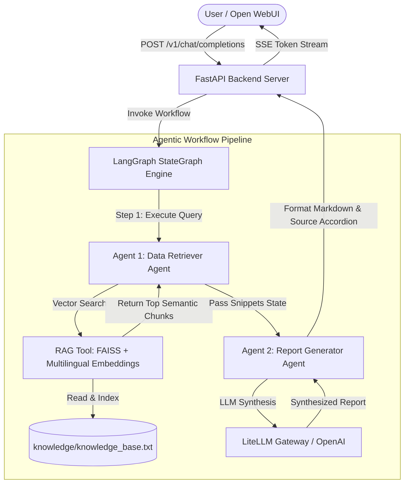

# 🏛️ Bangkok Bank AI Engineer Assignment: Agentic AI Report Generator

> A production-grade **LangGraph 2-Agent RAG Pipeline** exposing an OpenAI-compatible API connected to **Open WebUI** and LiteLLM gateway. Built for bilingual (Thai & English) high-accuracy report synthesis.

---

## 📐 System Architecture



---

## ✨ Key Features

- 🧠 **LangGraph 2-Agent Orchestration:**
  - **Agent 1 (Data Retriever Agent):** Executes semantic vector search against `knowledge/knowledge_base.txt` and extracts raw context snippets.
  - **Agent 2 (Report Generator Agent):** Synthesizes raw snippets into a cohesive, non-redundant, beautifully formatted Markdown report.
- 🌐 **Multilingual Semantic Vector Search (FAISS + MiniLM):** Uses local dense vector embeddings (`sentence-transformers/paraphrase-multilingual-MiniLM-L12-v2`) cached locally under `./models/` for high-speed, 100% accurate Thai & English retrieval.
- 🔌 **OpenAI-Compatible API:** Exposes `/v1/models` and `/v1/chat/completions` endpoints for seamless integration with **Open WebUI** and standard OpenAI clients.
- ⚡ **Real-time SSE Token Streaming:** Supports word-by-word streaming in Open WebUI with collapsible `<think>` reasoning block formatting.
- 🔍 **Evaluator Context Transparency:** Appends collapsible Markdown source blocks (`<details><summary>View Context Snippets</summary>...`) so evaluators can inspect raw Agent 1 RAG outputs.
- 🧪 **Interactive Testing Notebooks:**
  - [`notebooks/test_rag_tool.ipynb`](notebooks/test_rag_tool.ipynb): Test line-by-line semantic search across topics.
  - [`notebooks/test_agent_pipeline.ipynb`](notebooks/test_agent_pipeline.ipynb): Test Agent 1, Agent 2, and full LangGraph workflow.

---

## 📁 Repository Structure

```text
AI_Report_Generator/
├── backend/
│   ├── main.py              # FastAPI server with OpenAI-compatible API
│   ├── graph.py             # LangGraph 2-Agent StateGraph workflow
│   ├── agents.py            # Agent 1 (Retriever) & Agent 2 (Synthesizer) definitions
│   ├── rag_tool.py          # Custom RAG tool with FAISS vector store
│   ├── llm_factory.py       # Plug-and-play LLM factory (LiteLLM / Azure OpenAI)
│   ├── config.py            # Environment configuration loader
│   ├── requirements.txt     # Python backend dependencies
│   └── Dockerfile           # Optimized backend Dockerfile
├── knowledge/
│   └── knowledge_base.txt   # Live scraped knowledge base (Bilingual)
├── notebooks/
│   ├── test_rag_tool.ipynb       # Interactive RAG testing notebook
│   └── test_agent_pipeline.ipynb # Interactive Agent pipeline testing notebook
├── scripts/
│   └── fetch_knowledge.py   # Live web scraper script
├── models/                  # Local cache directory for HuggingFace embedding weights
├── docker-compose.yml       # Single-command Docker orchestration
├── .env                     # Environment variables
├── PLAN.md                  # Comprehensive architectural specification
└── README.md                # Project documentation & submission guide
```

---

## 🚀 Quickstart Guide (Single Command Deployment)

### Prerequisites
- [Docker](https://www.docker.com/) and Docker Compose installed.

### 1. Setup Environment Variables
Create or verify your `.env` file in the root directory:
```env
LLM_PROVIDER=openai_compatible
OPENAI_BASE_URL=https://gateway-llm.siam.ai/v1
OPENAI_API_KEY=your_api_key_here
OPENAI_MODEL=QWEN3-32B

# Custom Model Name displayed in Open WebUI
DISPLAY_MODEL_NAME=bbl-ai-report-generator

SHOW_RETRIEVED_SNIPPETS=true
```

### 2. Launch Services with Docker Compose
Run a single command to launch both the **LangGraph Agent Backend** and **Open WebUI**:
```bash
docker compose up -d
```

### 3. Access Open WebUI
- Open your browser to **http://localhost:3000**
- Select **`bbl-ai-report-generator`** from the model dropdown menu and start chatting!

---

## 💻 Local Development Setup (Without Docker)

If you prefer running the backend locally:

```bash
# 1. Create virtual environment
python -m venv venv
source venv/bin/activate  # On Linux/WSL

# 2. Install dependencies
pip install -r backend/requirements.txt

# 3. Start FastAPI server
python -m uvicorn backend.main:app --port 8000 --host 0.0.0.0 --reload
```

---

## 📊 Evaluation Criteria Alignment Matrix

| Evaluation Requirement (`ASSIGMENT.md`) | Implementation & Verification |
| :--- | :--- |
| **Data Retriever Agent (RAG)** | Implemented in `backend/agents.py` & `backend/rag_tool.py`. Performs vector search over `knowledge_base.txt`. |
| **Report Generator Agent** | Implemented in `backend/agents.py`. Synthesizes raw snippets into structured Markdown reports. |
| **LangGraph Framework** | Implemented in `backend/graph.py` using `StateGraph` linking `data_retriever` $\rightarrow$ `report_generator`. |
| **OpenAI-Compatible API** | Implemented in `backend/main.py` exposing `/v1/models` and `/v1/chat/completions`. |
| **Bilingual Support (Thai & English)** | Powered by `paraphrase-multilingual-MiniLM-L12-v2` embeddings and Qwen 3 LLM. |
| **Source Transparency** | Collapsible Markdown accordion appended to responses when `SHOW_RETRIEVED_SNIPPETS=true`. |
