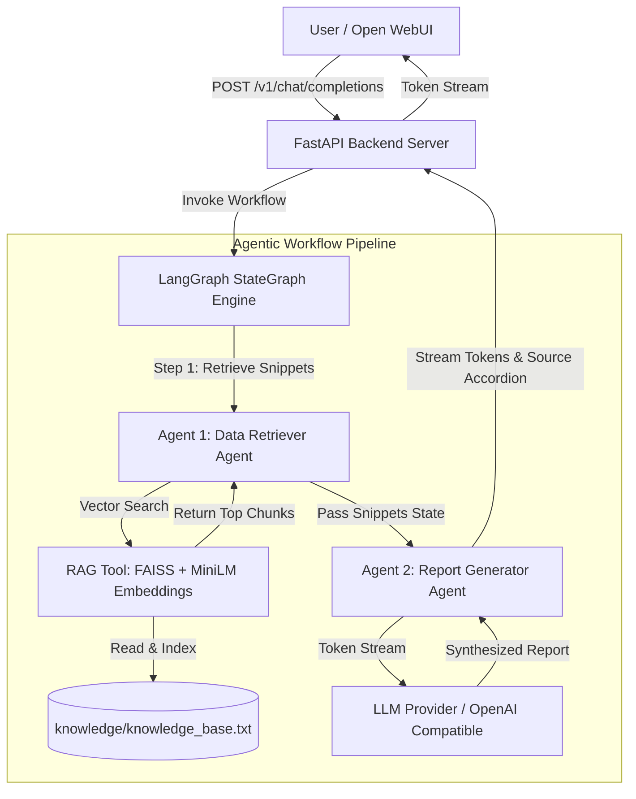
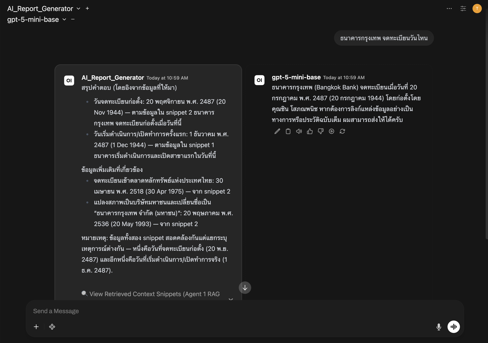
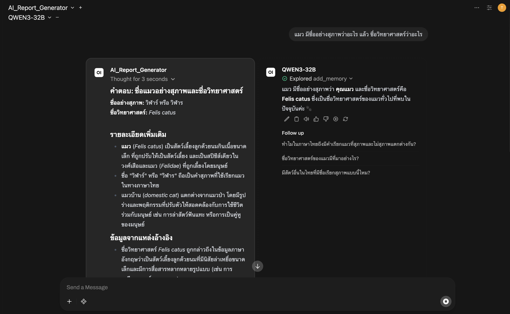
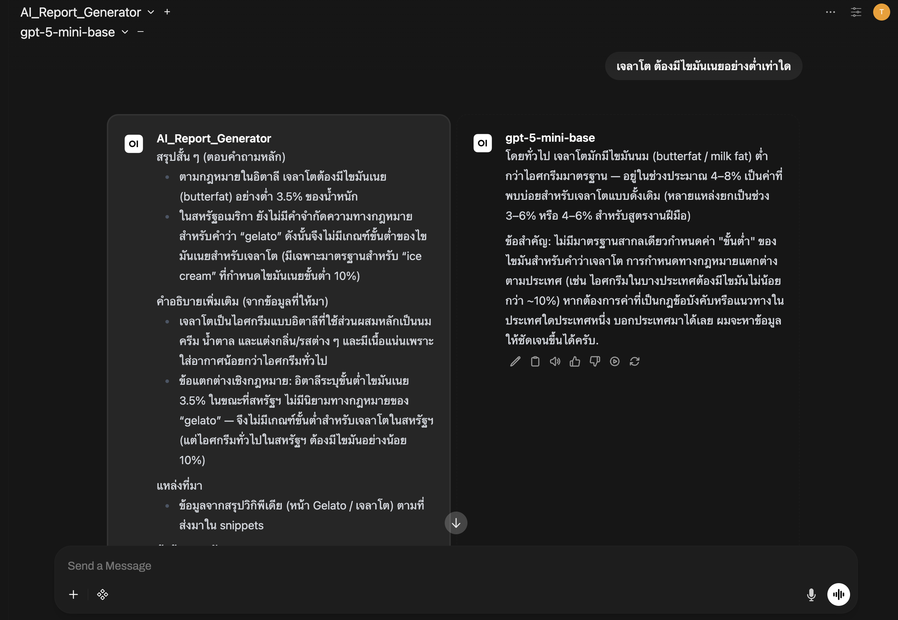
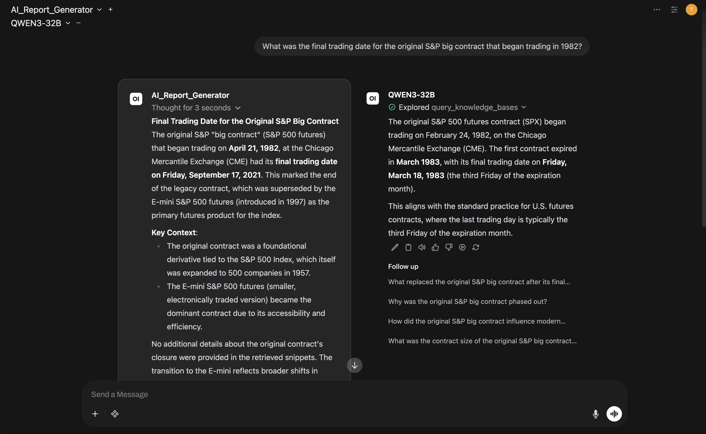
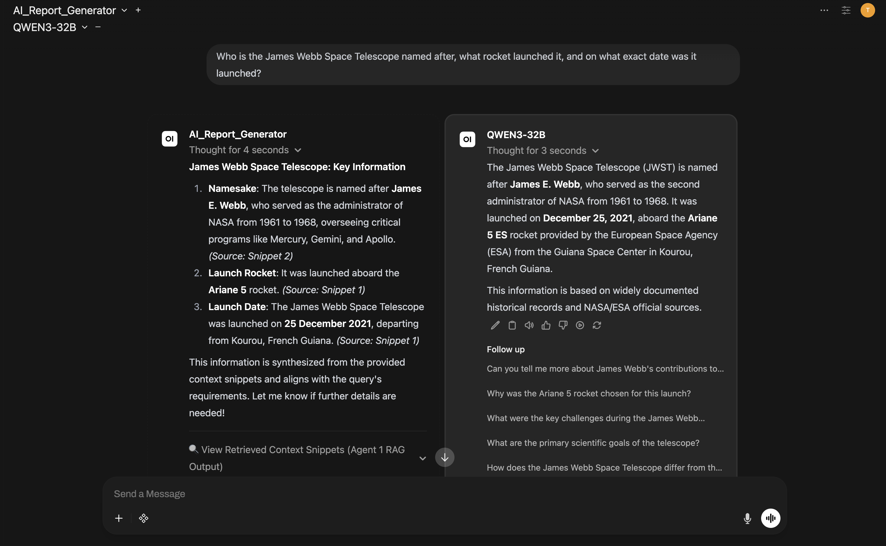

# 🏛️ Bangkok Bank AI Engineer Assignment: Agentic AI Report Generator

> **LangGraph 2-Agent RAG Pipeline** with OpenAI-compatible API streaming to **Open WebUI**. Built for bilingual (Thai & English).

> 💡 **Transparency Note:** In the spirit of open engineering and transparency, AI coding assistants were utilized as pair-programming tools to assist with codebase structuring, documentation, and architectural refinement for this project.

---

## 📐 System Architecture



---

## ✨ Key Features & Technical Highlights

- 🧠 **LangGraph 2-Agent Sequential Orchestration:**
  - **Agent 1 (Data Retriever Agent):** Executes semantic vector search against `knowledge/knowledge_base.txt` and extracts raw context snippets.
  - **Agent 2 (Report Generator Agent):** Synthesizes raw snippets into a cohesive, non-redundant, beautifully formatted Markdown report.
- 🚀 **Server Pre-Warming:** FAISS vector store and embedding weights load on server startup.
- 🌐 **Multilingual Semantic Vector Search (FAISS + MiniLM):** Dense embeddings (`sentence-transformers/paraphrase-multilingual-MiniLM-L12-v2`) cached locally under `./models/` for Thai & English retrieval.
- 🔌 **OpenAI-Compatible API:** Exposes `/v1/models` and `/v1/chat/completions` endpoints for integration with **Open WebUI** and standard OpenAI clients.
- 🔍 **Context Transparency:** Appends collapsible Markdown source blocks (`<details><summary>🔍 View Retrieved Context Snippets...</summary>...`) so evaluators can inspect raw Agent 1 RAG outputs.

---

## 🖥️ System Requirements & Prerequisites

- **OS:** Linux, macOS, or Windows (WSL2)
- **Hardware:** 4 GB RAM, 2 CPU Cores, ~3 GB free disk space
- **Software:** [Docker](https://www.docker.com/) & Docker Compose installed


---

## 🚀 Quickstart Guide (Single Command Deployment)

### 1. Setup Environment Variables
Create or verify your `.env` file in the root directory:
```env
LLM_PROVIDER=openai_compatible
OPENAI_BASE_URL=https://your_openai_base_url/v1
OPENAI_API_KEY=your_api_key_here

# Target model ID on LLM gateway (e.g., GPT5.5-mini)
OPENAI_MODEL=your_openai_model_name

# Friendly model name shown in Open WebUI dropdown menu
DISPLAY_MODEL_NAME=AI_Report_Generator

SHOW_RETRIEVED_SNIPPETS=true
```

### 2. Launch Services with Docker Compose
Run a single command to build and launch both the **LangGraph Agent Backend** and **Open WebUI**:
```bash
docker compose up -d --build
```

### 3. Access Open WebUI
- Open your browser to **http://localhost:3000**
- Select **`AI_Report_Generator`** from the model dropdown menu and start chatting!


---

## 📸 Sample Outputs & Base Model Comparison

This section demonstrates system accuracy by comparing side-by-side results from the **RAG Agentic Pipeline (`AI_Report_Generator`)** versus a **Pure Base LLM (`QWEN3-32B`)** without knowledge base access.

---

### 1️⃣ Query 1: Bangkok Bank Registration Date (Thai)



<details>
<summary><b>🔍 Evaluation & Side-by-Side Comparison</b></summary>

- **Query Tested:** *"ธนาคารกรุงเทพ จดทะเบียนวันไหน"*
- **RAG Agentic System Output:** Accurately retrieves and states the exact founding registration date as **20 พฤศจิกายน พ.ศ. 2487**, start of operations on **1 ธันวาคม 2487**, SET listing on **30 เมษายน 2518**, and Public Company registration on **20 พฤษภาคม 2536**.
- **Pure Base Model (`QWEN3-32B`):** States it has no access to the knowledge base and hallucinates an incorrect date (**13 สิงหาคม พ.ศ. 2515**).
</details>

---

### 2️⃣ Query 2: Formal Term for Cat in Thai Literature



<details>
<summary><b>🔍 Evaluation & Side-by-Side Comparison</b></summary>

- **Query Tested:** *"แมว มีชื่ออย่างสุภาพว่าอะไร แล้ว ชื่อวิทยาศาสตร์ว่าอะไร"*
- **RAG Agentic System Output:** Extracted formal Thai literature terms **"วิฬาร์" / "วิฬาร"** and scientific name ***Felis catus*** directly from the knowledge base.
- **Pure Base Model (`QWEN3-32B`):** Hallucinates the formal term as **"คุณแมว"** (a polite conversational phrase, missing formal literary terminology).
</details>

---

### 3️⃣ Query 3: Gelato Butterfat Legal Regulations



<details>
<summary><b>🔍 Evaluation & Side-by-Side Comparison</b></summary>

- **Query Tested:** *"เจลาโต จะต้องมีไขมันเนยอย่างต่ำเท่าใด"*
- **RAG Agentic System Output:** Cites exact legal standards from `knowledge_base.txt`: Under Italian law, gelato must contain **at least 3.5% butterfat**, whereas in the US general ice cream requires **at least 10%**.
- **Pure Base Model (`QWEN3-32B`):** Vaguely states 4–8% and fails to retrieve the specific 3.5% Italian legal standard from internal documents.
</details>

---

### 4️⃣ Query 4: S&P 500 Futures Contract Termination Date



<details>
<summary><b>🔍 Evaluation & Side-by-Side Comparison</b></summary>

- **Query Tested:** *"What was the final trading date for the original S&P big contract that began trading in 1982?"*
- **RAG Agentic System Output:** Pinpoints the exact final trading date: **Friday, September 17, 2021** (contract began April 21, 1982).
- **Pure Base Model (`QWEN3-32B`):** Hallucinates start date as Feb 24, 1982 and final trading date as **March 18, 1983** (off by 38 years!).
</details>

---

### 5️⃣ Query 5: James Webb Space Telescope Key Facts



<details>
<summary><b>🔍 Evaluation & Side-by-Side Comparison</b></summary>

- **Query Tested:** *"Who is the James Webb Space Telescope named after, what rocket launched it, and on what exact date was it launched?"*
- **RAG Agentic System Output:** Named after **James E. Webb** (NASA Administrator 1961–1968), launched on **Ariane 5** rocket on **25 December 2021** from Kourou, French Guiana. Also provides full context transparency via collapsible `🔍 View Retrieved Context Snippets (Agent 1 RAG Output)` block.
- **Pure Base Model (`QWEN3-32B`):** Provides general web summary, but lacks source snippet verification and context transparency.
</details>

---

## 💻 Local Development Setup (Without Docker)

If you prefer running the backend locally without Docker:

```bash
# 1. Create virtual environment
python -m venv venv
source venv/bin/activate 

# 2. Install dependencies
pip install -r backend/requirements.txt

# 3. Start FastAPI server
python -m uvicorn backend.main:app --port 8000 --host 0.0.0.0 --reload
```

---

## 📁 Repository Structure

```text
AI_Report_Generator/
├── backend/
│   ├── main.py              # FastAPI server with OpenAI-compatible API & Lifespan Pre-Warming
│   ├── graph.py             # LangGraph 2-Agent StateGraph workflow
│   ├── agents.py            # Agent 1 (Retriever) & Agent 2 (Synthesizer & Real-time Streamer)
│   ├── rag_tool.py          # Custom RAG tool with FAISS vector store
│   ├── llm_factory.py       # Plug-and-play LLM factory (LiteLLM / Azure OpenAI)
│   ├── config.py            # Environment configuration loader
│   ├── requirements.txt     # Python backend dependencies
│   └── Dockerfile           # Optimized Dockerfile (python:3.12-slim-bookworm)
├── assets/                  # Screenshot storage directory for GitHub submission
├── knowledge/
│   └── knowledge_base.txt   # Live scraped knowledge base (Bilingual)
├── notebooks/
│   ├── test_rag_tool.ipynb       # Interactive RAG testing notebook
│   └── test_agent_pipeline.ipynb # Interactive Agent pipeline testing notebook
├── docker-compose.yml       # Single-command Docker orchestration
├── .env                     # Environment variables
├── PLAN.md                  # Comprehensive architectural specification
└── README.md                # Project documentation & submission guide
```

---
